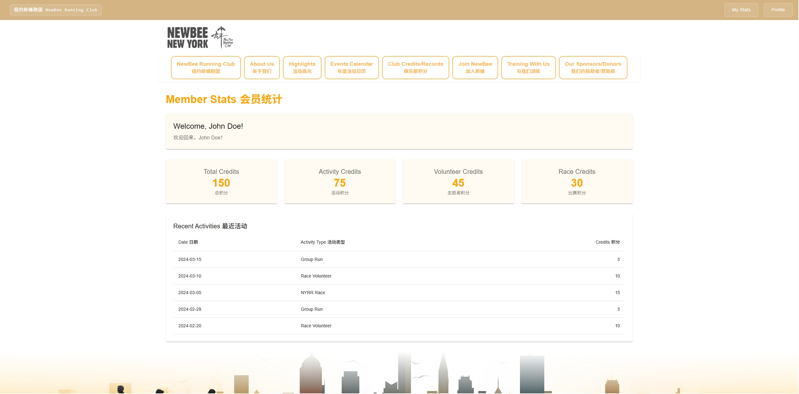
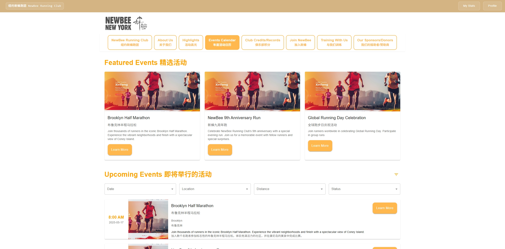
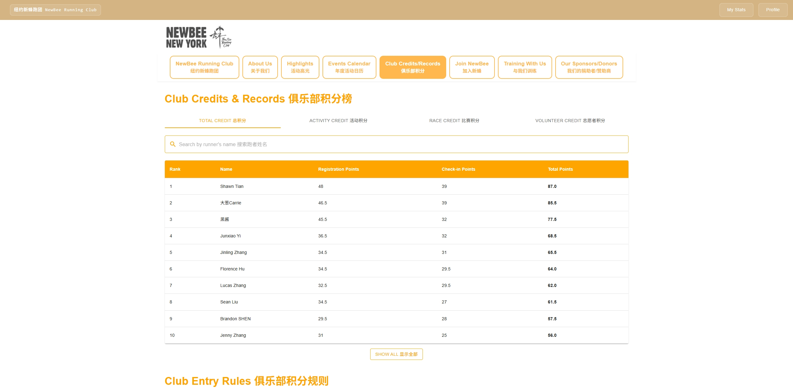

# NewBee Running Club Website

Official website for NewBee Running Club, a running community based in New York.

## Project Overview

This is a full-stack web application built with React (frontend) and Node.js (backend) to serve the NewBee Running Club community. The website provides features for member management, event organization, and running records tracking.

## Screenshots

### Home Page

*Welcome page with club highlights and upcoming events*

### Member Dashboard

*Personal dashboard showing running statistics and achievements*

### Event Calendar

*Interactive calendar showing upcoming running events and training sessions*

### Records Page

*Club records and member achievements*

### Join Page

*Membership application form with club rules and requirements*

## Directory Structure

### ProjectCode/
The main application code is organized in a client-server architecture:

#### client/
Frontend React application
- `src/`
  - `components/` - Reusable UI components
  - `pages/` - Main page components
    - HomePage.js
    - AboutPage.js
    - CalendarPage.js
    - HighlightsPage.js
    - JoinPage.js
    - LoginPage.js
    - ProfilePage.js
    - RecordsPage.js
    - RegisterPage.js
    - SponsorsPage.js
    - TrainingPage.js
  - `styles/` - CSS and styling files
  - `data/` - Static data files
  - `helpers/` - Utility functions
  - `firebase/` - Firebase configuration and services
  - `context/` - React context providers
  - `App.js` - Main application component
  - `index.js` - Application entry point
  - `config.json` - Frontend configuration

#### server/
Backend Node.js application
- `server.js` - Main server file
- `routes.js` - API route definitions
- `config.json` - Server configuration
- `package.json` - Node.js dependencies

### SQL/
Database management scripts
- `createTables.txt` - SQL commands for database setup
- Additional database management scripts

### cleaned-data/
Processed datasets ready for database import
- Contains cleaned and formatted data for the application

## Features

- Member registration and authentication
- Event calendar and registration
- Running records and achievements tracking
- Club highlights and news
- Training resources
- Sponsor information
- Member profiles

## Technology Stack

- Frontend:
  - React
  - Material-UI
  - Firebase Authentication
  - Context API for state management

- Backend:
  - Node.js
  - Express.js
  - SQLite Database

## Getting Started

1. Clone the repository
2. Install dependencies:
   ```bash
   # Install server dependencies
   cd ProjectCode/server
   npm install

   # Install client dependencies
   cd ../client
   npm install
   ```
3. Set up the database using scripts in the SQL directory
4. Configure environment variables in config.json files
5. Start the development servers:
   ```bash
   # Start backend server
   cd ProjectCode/server
   npm start

   # Start frontend development server
   cd ../client
   npm start
   ```

## Contributing

Please read our contributing guidelines before submitting pull requests.

## License

This project is licensed under the MIT License - see the LICENSE file for details.
